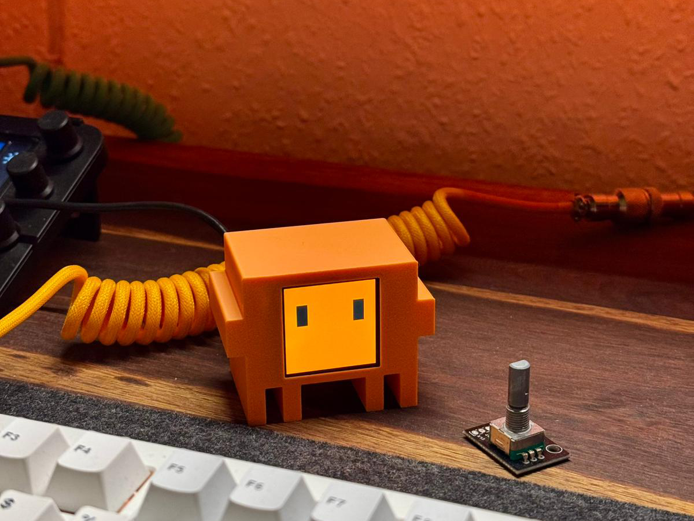
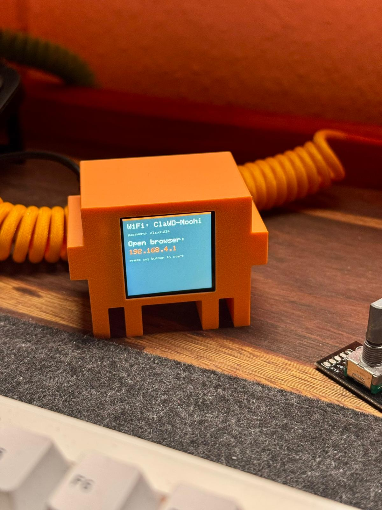

# cc-mochi

`cc-mochi` is a small ESP32-C3 + ST7789 desk display for Claude Code and Codex. It shows agent activity as expressive hardware states, then adds a local bridge daemon, global hooks, USB serial JSON Lines control, WiFi debugging, and compact usage cards.

The hardware UI is intentionally not a numeric dashboard. The expression is the main signal; usage appears as small branded cards with a ring, bar, reset label, and short badges.


## Attribution

This project is based on [`clawd-mochi`](https://github.com/yousifamanuel/clawd-mochi) by Yousuf Amanuel. `cc-mochi` keeps the hardware/display foundation and extends it with Claude Code/Codex bridge hooks, serial JSON Lines control, usage cards, and renamed project assets.

## Highlights

- Large expression states for `thinking`, `reading`, `writing`, `shell`, `permission`, `compact`, `subagent`, `success`, `error`, `blocked`, `sleeping`, and multi-session activity.
- Idle carousel driven by the daemon: sleeping face plus Codex/Claude usage cards.
- Codex usage from local `codex app-server` rate-limit RPC when available.
- Claude Code usage from Claude subscription sources when available; custom API-key/base-url setups are marked as local/API mode instead of being misreported as subscription quota.
- Existing WiFi web controller and legacy `/cmd`, `/char`, `/canvas`, `/draw/*`, `/backlight`, `/state` routes remain available.

## Gallery

| Device | Startup | Agent activity |
| --- | --- | --- |
|  |  |  |

| Web controller | 3D model |
| --- | --- |
|  |  |

## Firmware

Open `cc_mochi.ino` in Arduino IDE and upload to an ESP32-C3 Dev Module.

Board settings:

| Setting | Value |
| --- | --- |
| Board | ESP32C3 Dev Module |
| USB CDC On Boot | Enabled |
| CPU Frequency | 160 MHz |
| Upload Speed | 921600 |

Required Arduino libraries:

- `Adafruit GFX Library`
- `Adafruit ST7735 and ST7789 Library`

The device starts a WiFi AP named `cc-mochi` with password `ccmochi1234`, and it also listens on USB serial at `115200`.

## Bridge Daemon

Start the local bridge from this repository.

```bash
python3 -m cc_mochi --port /dev/cu.usbmodem101
```

If the port is omitted, the daemon auto-detects common USB serial device names:

```bash
python3 -m cc_mochi
```

`pyserial` is optional. Without it, the daemon uses the local tty directly.

Dry-run mode prints device messages without touching hardware:

```bash
python3 -m cc_mochi --dry-run
```

## Hooks

Install global hooks for both Claude Code and Codex:

```bash
python3 -m cc_mochi.install_hooks
```

The installer backs up existing config files before writing:

- Claude Code: `~/.claude/settings.json`
- Codex: `~/.codex/hooks.json`

The hook commands are intentionally small and non-blocking. If the daemon is not running, hook events are spooled to `~/.cc-mochi/missed-hooks.jsonl` and the hook exits successfully.

## Project Layout

```text
cc_mochi.ino          ESP32-C3 firmware
cc_mochi/             bridge daemon, hooks, usage providers, serial protocol
tests/                unit tests for protocol and usage parsing
tools/                browser-based serial tester and expression preview
models/               printable case/model files
pics/                 README and project images
```

## Serial Protocol

The daemon sends one JSON object per line.

State:

```json
{"type":"state","source":"codex","state":"shell","label":"Bash","active":1}
```

Usage:

```json
{"type":"usage","provider":"codex","primary":23,"secondary":29,"reset":"1h20m","badge":"plus","unavailable":false,"stale":false}
```

Ping:

```json
{"type":"ping"}
```

The firmware responds with short JSON ACK lines.

## HTTP Debug Routes

The same new UI can be driven over WiFi:

```text
/cc/state?source=codex&state=thinking&label=prompt&active=1
/cc/usage?provider=codex&primary=42&secondary=10&reset=1h20m&badge=plus
```

Legacy routes are kept for the original controller:

```text
/cmd?k=w
/cmd?k=s
/cmd?k=d
/char?c=x
/canvas?on=1
/draw/clear
/draw/stroke
/backlight?on=1
/state
```

## Usage Source Policy

Codex usage priority:

1. `codex -s read-only -a untrusted app-server` JSON-RPC `account/rateLimits/read`
2. Future OAuth/backend provider
3. Future `/status` PTY parser
4. Local hook activity stats only as activity, not quota

Claude Code usage priority:

1. Claude OAuth usage API when local OAuth credentials are available
2. Future opt-in Claude Web API cookie provider
3. CLI `/usage` parser
4. Admin API only for organization/API usage and cost
5. Local stats only as activity, not subscription quota

If `ANTHROPIC_BASE_URL` points to a non-Anthropic endpoint, or an API-key mode is detected, cc-mochi displays Claude subscription usage as unavailable/local.

## Development

Run tests:

```bash
python3 -m pytest
```

If `pytest` is not installed, the tests are plain enough to run after installing it in your preferred environment. No hardware is required for the unit tests.

## Hardware

Printable model files live in `models/`. The `cc_mochi` case is provided as `.3mf` and `.stl`; additional inherited model variants are kept as-is so their filenames continue to match the upstream asset names.

## License

Code is MIT licensed. Existing 3D models and media assets retain their original CC BY-NC-SA 4.0 licensing note where applicable.
