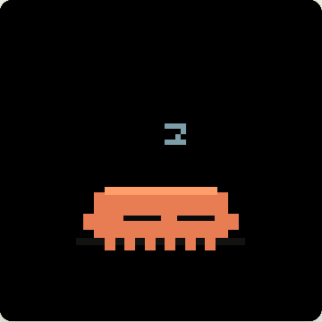
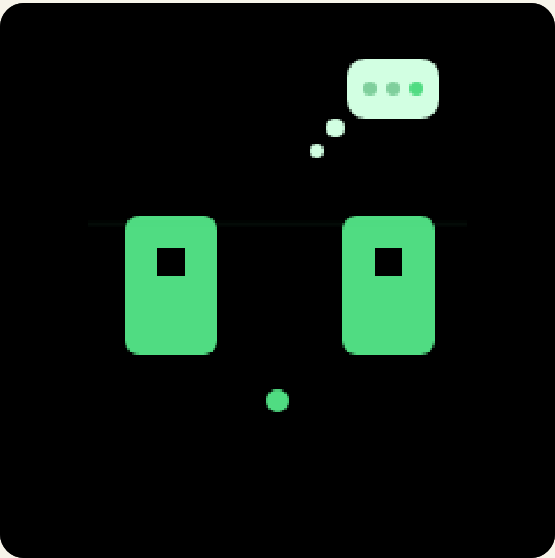
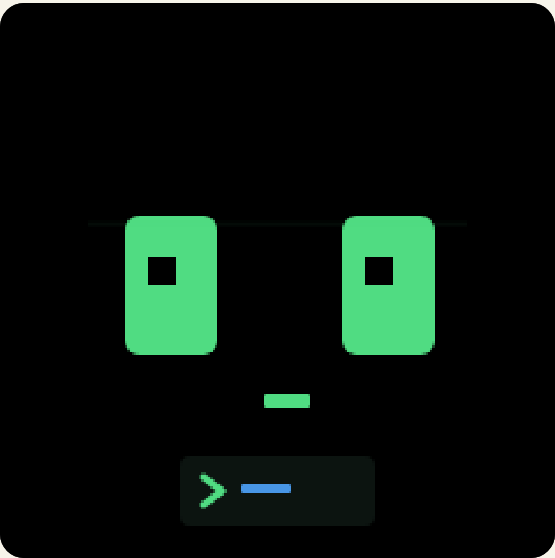
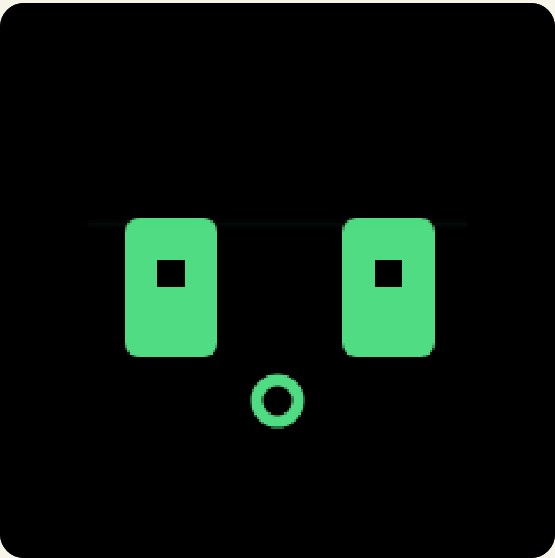
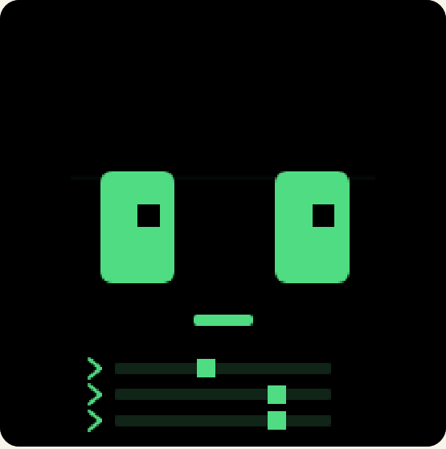

# cc-mochi

<p align="right"><a href="README.en.md">English</a> | <b>中文</b></p>

`cc-mochi` 是一个放在桌面上的 ESP32-C3 + ST7789 小屏摆件，用来陪伴 Claude Code 和 Codex。它把 agent 正在做的事，实时变成一张会「做表情」的小脸——思考、读文件、写代码、跑命令、等你授权、压缩上下文、并行子任务、成功、报错……都有对应的神态。它不是一块数字仪表盘：**表情本身才是主要信号**，用量只作为空闲时的小卡片轻描淡写地出现。

## 这个项目改了什么

`cc-mochi` 基于 [`clawd-mochi`](https://github.com/yousifamanuel/clawd-mochi)（作者 Yousuf Amanuel）。它保留了原项目的硬件与显示基础，围绕「陪伴 Claude Code / Codex」做了三处大改：

1. **重画了整套表情**——为 Claude 和 Codex 设计了两套完全不同的脸，配合十余种 agent 状态。
2. **重做了开机动画**——从原来的 logo 揭示，改成 mochi「入睡→被唤醒→开始打字」的连贯小剧场。
3. **新增了桥接链路**——本地 daemon + 全局 hooks + USB 串口 JSON Lines 协议，把两个 CLI 的事件喂给屏幕，并在空闲时轮播用量卡片。

## 表情系统（核心）

cc-mochi 会根据事件来源，切换成**两套气质不同的脸**：

| | Claude 风格 | Codex 风格 |
| --- | --- | --- |
| 底色 | 暖橙 | 纯黑 |
| 眼睛 | 深色圆润大眼，会眨眼、会脸红 | 绿色像素方块眼，终端机械感 |
| 嘴型 | 柔和圆弧（沉思波浪 / 大笑弧 / 皱眉弧） | 方形 / 像素直线，配扫描线 |
| 卡壳时 | 半闭平眼「在听但卡住了」 | X 形死机眼 |

每种状态除了改变眼和嘴，还会在脸下方叠加一个**小道具/动画**（思考点、命令提示符、并行会话泳道、子任务节点图等）。动画是非阻塞的，眨眼、扫描线等会在待机时自然循环。

支持的状态：

| 状态 | 含义 |
| --- | --- |
| `sleeping` / `idle` | 空闲待机（会轮播用量卡片） |
| `thinking` | 思考中（提交 prompt、会话开始） |
| `reading` | 读取（Read / Grep / Glob / LS） |
| `writing` | 写入（Edit / Write / MultiEdit） |
| `shell` | 执行命令（Bash / Shell） |
| `permission` | 等待授权 / 通知 |
| `compact` | 压缩上下文 |
| `subagent` | 子任务运行中 |
| `multi` | 多个会话并行活跃 |
| `success` | 成功 / 完成（短暂闪现） |
| `error` | 出错 |
| `blocked` | 权限被拒 / 卡住 |
| `usage_low` / `usage_critical` | 用量偏高 / 接近耗尽的疲惫脸 |

当多个会话同时活跃时，屏幕会进入 `multi` 状态显示并行泳道；出现需要你关注的高优先级事件（如 `permission`、`error`）时，会优先顶到最前面。

## 开机动画

<p align="center"></p>

上电后播放一段重新设计的小剧场：mochi 先闭眼睡着，被唤醒后揉眼睛，接着坐到键盘前开始敲代码，最后屏幕打出 `cc-mochi` 收尾。整段动画都会顺带响应 WiFi 请求，不会卡住 Web 控制器。

> 上面这段是固件开机序列的像素级复刻，逐帧渲染合成。想看实时版可用浏览器打开 `tools/cc_mochi_boot_preview.html`。

## Hooks 工作原理

cc-mochi 通过 Claude Code / Codex 的**全局 hooks** 感知 agent 在做什么，链路如下：

```
Claude Code / Codex 事件
      │  (hook 命令，逐条 stdin JSON)
      ▼
cc_mochi.hook  ──►  本地 daemon (Unix socket)
      │                    │  归一化 + 按优先级选状态
      │                    ▼
      │            USB 串口 JSON Lines
      │                    ▼
      └─ daemon 未运行时          ESP32-C3 屏幕表情
         事件落盘到
         ~/.cc-mochi/missed-hooks.jsonl
```

hook 命令刻意做得极小、非阻塞：只把事件转发给 daemon 就立刻退出。**即使 daemon 没在跑，hook 也会成功退出**，事件被记到 `~/.cc-mochi/missed-hooks.jsonl`，绝不拖慢你的 CLI。

daemon 收到事件后会：归一化成上面的状态、按严重程度选出当前最该显示的那个、追踪多个并发会话、并在空闲时刷新用量卡片。

## 表情一览

下面这些图直接来自固件的表情渲染。**同一状态，Claude 和 Codex 是两张完全不同的脸**：

**Claude 风格**（暖橙底、深色圆眼、会眨眼脸红、圆弧嘴）

| thinking | reading | writing | shell |
| :---: | :---: | :---: | :---: |
|  |  |  |  |
| **permission** | **success** | **error** | **multi** |
|  |  |  |  |

**Codex 风格**（纯黑底、荧光绿像素方块眼、X 死机眼、扫描线）

| thinking | reading | writing | shell |
| :---: | :---: | :---: | :---: |
|  |  |  |  |
| **permission** | **success** | **error** | **multi** |
|  |  |  |  |

`pics/expressions/` 下有全部 14 个状态 × 2 风格的图；想看带动画的实时预览，用浏览器打开 `tools/cc_mochi_expression_preview.html`（呼吸、眨眼、扫描线都会动，不需要连真机）。

## 画廊

<p align="center"></p>

## 固件烧录

用 Arduino IDE 打开 `cc_mochi.ino`，上传到 ESP32-C3 Dev Module。

开发板设置：

| 项 | 值 |
| --- | --- |
| Board | ESP32C3 Dev Module |
| USB CDC On Boot | Enabled |
| CPU Frequency | 160 MHz |
| Upload Speed | 921600 |

需要的 Arduino 库：

- `Adafruit GFX Library`
- `Adafruit ST7735 and ST7789 Library`

设备会开一个名为 `cc-mochi` 的 WiFi AP（密码 `ccmochi1234`），同时以 `115200` 波特率监听 USB 串口。

## 桥接守护进程（daemon）

在本仓库目录下启动本地桥：

```bash
python3 -m cc_mochi --port /dev/cu.usbmodem101
```

不指定端口时，daemon 会自动探测常见的 USB 串口设备名：

```bash
python3 -m cc_mochi
```

`pyserial` 是可选依赖。没装时，daemon 会直接用本地 tty。

Dry-run 模式只打印将要发给设备的消息，不碰硬件：

```bash
python3 -m cc_mochi --dry-run
```

## 安装 Hooks

一键为 Claude Code 和 Codex 安装全局 hooks：

```bash
python3 -m cc_mochi.install_hooks
```

只装其中一个：

```bash
python3 -m cc_mochi.install_hooks --claude
python3 -m cc_mochi.install_hooks --codex
```

安装器写入前会自动备份已有配置：

- Claude Code：`~/.claude/settings.json`
- Codex：`~/.codex/hooks.json`

## 用量卡片

空闲时，daemon 会轮播 Codex 和 Claude 的用量卡片（环形 + 进度条 + 重置时间 + 短徽章），用量偏高时脸会变成 `usage_low` / `usage_critical` 的疲惫神态。

- **Codex** 用量来自本地 `codex app-server` 的限速 RPC（可用时）。
- **Claude Code** 用量优先取 Claude 订阅来源；若检测到自定义 API-key / base-url，会标记为「本地 / API 模式」，而不是误报成订阅额度。

## 串口协议

daemon 每行发送一个 JSON 对象。

状态：

```json
{"type":"state","source":"codex","state":"shell","label":"Bash","active":1}
```

用量：

```json
{"type":"usage","provider":"codex","primary":23,"secondary":29,"reset":"1h20m","badge":"plus","unavailable":false,"stale":false}
```

心跳：

```json
{"type":"ping"}
```

固件会用简短的 JSON ACK 行回应。

## HTTP 调试路由

同一套新 UI 也能通过 WiFi 驱动：

```text
/cc/state?source=codex&state=thinking&label=prompt&active=1
/cc/usage?provider=codex&primary=42&secondary=10&reset=1h20m&badge=plus
```

原控制器的旧路由继续保留：

```text
/cmd?k=w    /cmd?k=s    /cmd?k=d
/char?c=x
/canvas?on=1
/draw/clear    /draw/stroke
/backlight?on=1
/state
```

## 用量来源策略

Codex 用量优先级：

1. `codex -s read-only -a untrusted app-server` 的 JSON-RPC `account/rateLimits/read`
2. 未来的 OAuth / 后端 provider
3. 未来的 `/status` PTY 解析
4. 本地 hook 活动统计——只当作「活跃度」，不当额度

Claude Code 用量优先级：

1. 本地有 OAuth 凭据时，走 Claude OAuth 用量 API
2. 未来可选的 Claude Web API cookie provider
3. CLI `/usage` 解析
4. Admin API 仅用于组织 / API 层面的用量与花费
5. 本地统计只当「活跃度」，不当订阅额度

若 `ANTHROPIC_BASE_URL` 指向非 Anthropic 端点，或检测到 API-key 模式，cc-mochi 会把 Claude 订阅用量显示为不可用 / 本地模式。

## 项目结构

```text
cc_mochi.ino          ESP32-C3 固件
cc_mochi/             桥接 daemon、hooks、用量 provider、串口协议
tests/                协议与用量解析的单元测试
tools/                浏览器版串口测试器与表情预览
models/               可打印的外壳 / 模型文件
pics/                 README 与项目图片
```

`tools/cc_mochi_expression_preview.html` 可以在浏览器里直接预览所有表情，`tools/cc_mochi_tester.html` 可用串口驱动真机调试。

## 开发

跑测试：

```bash
python3 -m pytest
```

单元测试不依赖任何硬件。

## 硬件

可打印模型文件在 `models/` 下。`cc_mochi` 外壳提供 `.3mf` 与 `.stl`；其余继承自上游的模型变体按原样保留，文件名与上游资产保持一致。

## 致谢与许可

基于 [`clawd-mochi`](https://github.com/yousifamanuel/clawd-mochi)（作者 Yousuf Amanuel）。

代码采用 MIT 许可。已有的 3D 模型与媒体资产在适用处保留其原始的 CC BY-NC-SA 4.0 许可声明。
